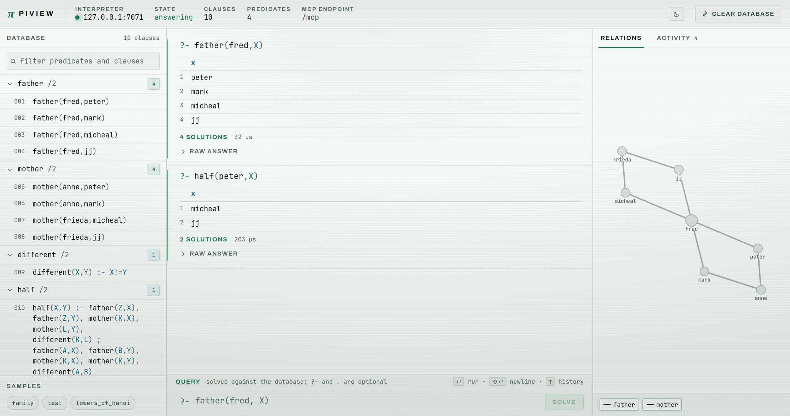

# PI — Prolog Interpreter Engine

A small Prolog interpreter written in C++, built to be read as much as to be
used. It is deliberately compact: a hand-written recursive-descent parser, a
flat node stack, and a database with an indexed `name/arity` lookup, in around
seven thousand lines.

There are no third-party dependencies — just the C++ standard library, plus
POSIX termios for the line editor and BSD sockets for the optional server.

## Building

```sh
make            # optimised build -> ./prolog
make debug      # symbols, no optimisation, stack tracing enabled
make test       # run the test suite
make clean
```

Requires a C++17 compiler. Sources live in `src/`, intermediate files in
`build/`, and the finished `prolog` binary in the root of the repository.
Override the compiler with `make CXX=clang++`.

```
src/        the interpreter
samples/    example prolog programs
tests/      the test suites
docs/       architecture notes
```

## Running

```sh
./prolog                        # empty database
./prolog samples/family.pl      # load a program at startup
./prolog --port 7071 f.pl       # also serve it over TCP (see below)
./prolog --help                 # usage summary (-h also works)
```

At the `>` prompt:

| Input | Effect |
| --- | --- |
| `?- father(fred,X).` | run a query — starts with `?-`, ends with `.` |
| `likes(pete,prolog).` | anything else is asserted into the database |
| `list` | list the database; `list 3` or `list 3-7` for a range |
| `delete 3-7` | remove rules by their `list` number |
| `load <file>` | load a program (adds to the current database) |
| `new` | clear the database |
| `tron` / `troff` | stack tracing on/off — needs `make debug` |
| `help` | command summary |
| `exit` | quit (`quit`, `bye` and Ctrl-D also work) |

Queries report each solution as variable bindings, or `yes` when a query
succeeds without binding anything, or `no` on failure.

```
> ?- father(fred,X).
X=peter
X=mark
X=micheal
X=jj

> ?- father(fred,zoe).
no
```

### Line editing

The prompt has bash-style editing and a command history that persists between
sessions in `~/.pi_history`. It turns itself off when input is a pipe or a
file, so the interpreter still scripts cleanly.

| Key | Effect |
| --- | --- |
| `↑` / `↓`, `Ctrl-P` / `Ctrl-N` | walk through previous commands |
| `←` / `→`, `Ctrl-B` / `Ctrl-F` | move the cursor |
| `Ctrl-←` / `Ctrl-→`, `Alt-B` / `Alt-F` | move a word at a time |
| `Home` / `End`, `Ctrl-A` / `Ctrl-E` | start / end of line |
| `Backspace`, `Delete` | delete a character |
| `Ctrl-W` | delete the word before the cursor |
| `Alt-Backspace` | delete the word before the cursor, stopping at punctuation |
| `Ctrl-U` / `Ctrl-K` | delete to the start / end of the line |
| `Ctrl-T` | swap the last two characters |
| `Ctrl-L` | clear the screen |
| `Ctrl-C` | abandon the line |
| `Ctrl-D` | delete forward, or exit on an empty line |

## Server mode

`--port <n>` additionally serves the interpreter over TCP. Send a command per
line, get the answer back as text, so anything that can write to a socket can
drive it:

```sh
./prolog --port 7071 samples/family.pl

echo '?- father(fred,X).' | nc localhost 7071
```
```
X=peter
X=mark
X=micheal
X=jj
```

Everything that works at the prompt works over the socket — queries, new
clauses, `list`, `delete`, `load`, `new`, `help`. Several commands can go down
one connection and are answered in order; `exit` closes that connection and
leaves the server running.

The prompt stays live while clients are connected, and they all share one
database — a clause typed at the prompt is visible to every client, and a
clause a client asserts is visible at the prompt.

Each connection gets its own thread, but **commands are executed one at a
time**. The engine keeps its state in globals (the node stack, the string
table, the trace flag), so a single lock serialises execution; concurrency
buys you clients that never block each other on I/O, not parallel solving.

`--bind <addr>` chooses the interface, and it defaults to `127.0.0.1`.
That default is deliberate: the protocol has no authentication and `load`
reads files from the server's filesystem, so anyone who can reach the port can
read any file the interpreter can. Use `--bind '*'` to listen on every
interface only on a network you trust.

## piview — MCP server and web view

[piview/](piview) attaches to a running interpreter over that port and gives it
two more faces: an MCP server, so an agent can query and edit the database with
typed tools, and a web view of the same interpreter in the browser. The database
stays shared — a clause typed at the prompt, one asserted by an agent, and the
listing in the browser are all the same database.



The view opens light; the button beside *clear database* switches it to a dark
phosphor ground.

```sh
docker compose up --build        # pi on 7071, piview on http://127.0.0.1:7070
```

or, against an interpreter you started yourself:

```sh
./prolog --port 7071 samples/family.pl
cd piview/server && ./gradlew installDist
./build/install/piview/bin/piview --samples ../../samples
```

The server is Kotlin, the view is React and TypeScript, and both ship in one
jar. To put it on a server, `piview/install/build-installer.sh` makes a package
that installs it under systemd on Ubuntu 24.04, Debian 13 or Fedora 44. See
[piview/README.md](piview/README.md).

## Language

Facts, rules and queries use standard Prolog syntax. A bare `?` is also
accepted as the query marker.

```prolog
% comments run from % to end of line

father(fred,peter).                  % a fact
different(X,Y) :- X != Y.            % a rule
?- different(a,b).                   % a query
```

Variables begin with an uppercase letter or `_`; `_` alone is the anonymous
variable. Atoms begin with a lowercase letter. Quoted strings use single
quotes: `write('Move top disk from ')`.

| Category | Supported |
| --- | --- |
| Control | `,` (and), `;` (or), `:-` (implies), `!` (cut), `not(...)`, `fail` |
| Comparison | `==`, `!=`, `<`, `<=`, `>`, `>=` |
| Arithmetic | `=` (evaluate and bind), `+`, `-`, `*`, `/` |
| Lists | `[a,b,c]`, `[]`, `[H\|T]` |
| Built-ins | `write/1`, `nl/0` |

Arithmetic uses `=` where standard Prolog uses `is`:

```prolog
?- X = 3 - 1.                % X=2
?- A = 7 - 2, B = A + 1.     % A=5  B=6
```

Values computed in a rule body are visible to the caller, so rules compose in
the usual way:

```prolog
len([],0).
len([H|T],N) :- len(T,M), N = M + 1.
?- len([a,b,c],N).           % N=3
```

## Samples

Three programs in [samples/](samples):

```sh
./prolog samples/family.pl
> ?- half(peter,X).              # half-siblings: X=micheal, X=jj

./prolog samples/test.pl
> ?- test([a,b,c]).              # walks a list, printing each element

./prolog samples/towers_of_hanoi.pl
> ?- move(3,left,right,centre).  # the 7 move solution
```

## Tests

```sh
make test
```

[tests/run_tests.sh](tests/run_tests.sh) runs 50 checks covering unification,
lists, arithmetic, cut, negation, head-variable propagation and the three
sample programs.

Two further suites need `python3` and are skipped without it:

- [tests/test_interactive.py](tests/test_interactive.py) — 28 line-editor
  checks, driving the interpreter under a pty and asserting on the answer each
  edited line produces.
- [tests/test_server.py](tests/test_server.py) — 13 server checks, including
  20 concurrent clients and that the prompt and the network share a database.

## How it works

There is a fuller architecture description in
[docs/c4-model.md](docs/c4-model.md) — context, containers, components and the
code-level structures, with diagrams, for the interpreter and for piview beside
it. The short version:

Source text becomes a tree of `Structure` nodes ([parser.cpp](src/parser.cpp)),
which is flattened into a list of `Node` records ([node.cpp](src/node.cpp)). Each
node carries its subtree size, so the engine walks a clause by index rather
than by pointer chasing.

Clauses are copied onto a single flat stack to be solved
([engine.cpp](src/engine.cpp), [query.cpp](src/query.cpp)). Variables are bound by a
forward link to another stack slot, so resolving a variable means following
that chain to its end. `DataBase` ([database.cpp](src/database.cpp)) indexes
clauses by `name/arity` so matching candidates are found without scanning.

A goal is solved to its **complete set of solutions** in one pass rather than
by backtracking through choice points. That is the main thing to know when
reading the engine: it is why the cut is implemented by truncating a solution
list, and why a query with very many solutions holds them all at once.

[interpreter.cpp](src/interpreter.cpp) turns one line of input into an answer and
is the single entry point shared by the prompt and by
[server.cpp](src/server.cpp). Output goes through an `IOWriter` that is per
thread, which is what lets a client capture its own answer while the prompt
keeps printing on the main thread.

## Notes and limitations

- **`=` is both assignment and unification.** Against a free variable it
  binds; against an already-bound one it compares. There is no separate `is`.
- **No `assert`/`retract`.** The database is changed from the prompt (typing a
  clause, `delete`, `new`) rather than from within a program.
- **Deep recursion is bounded** by `Query::MAX_PC` (1.5M stack entries), which
  reports "infinite recursion detected" rather than crashing.
- **Text is byte-oriented.** The line editor and the parser assume one byte per
  character, so multi-byte UTF-8 input is not handled.

## Licence

Copyright (C) 2004 Rock de Vocht.

Licensed under the Apache License, Version 2.0 — see [LICENSE](LICENSE).
