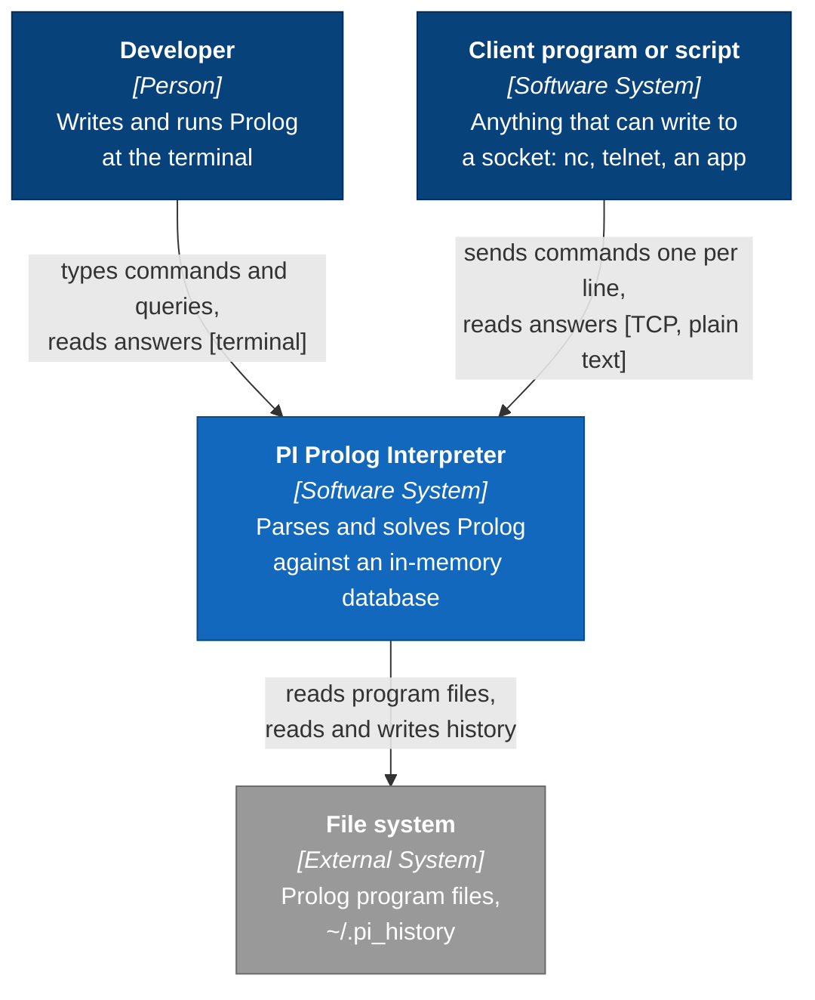
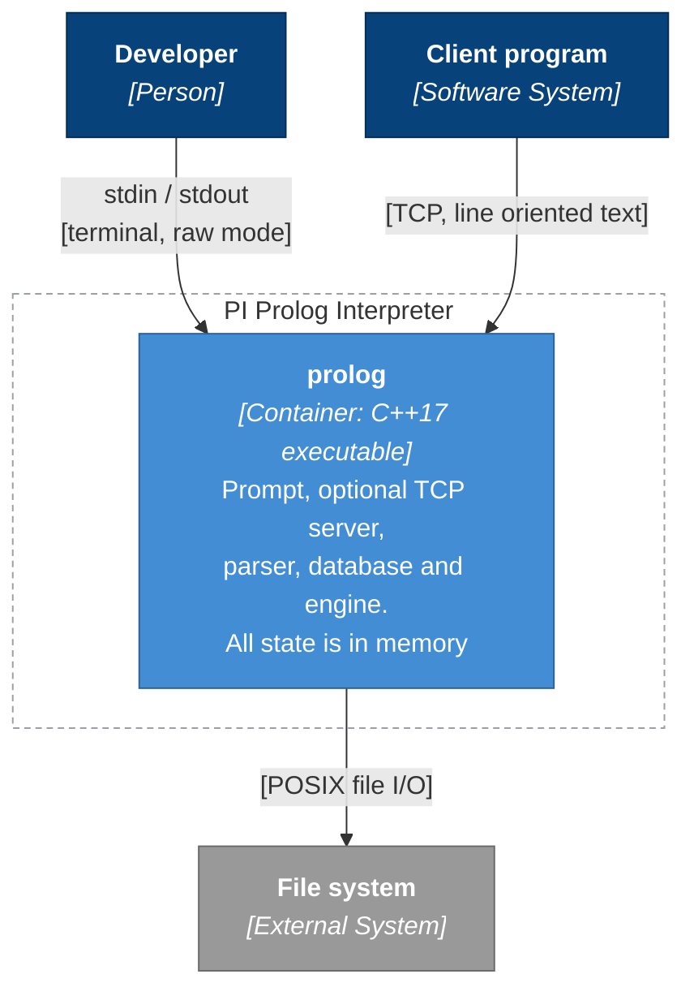
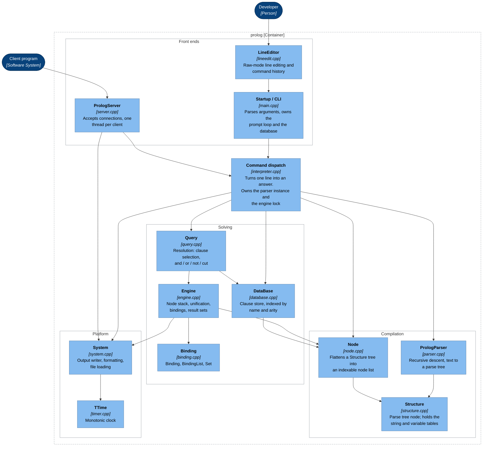
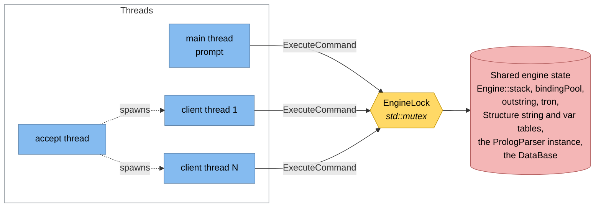
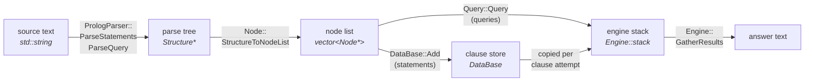
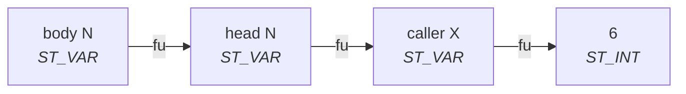
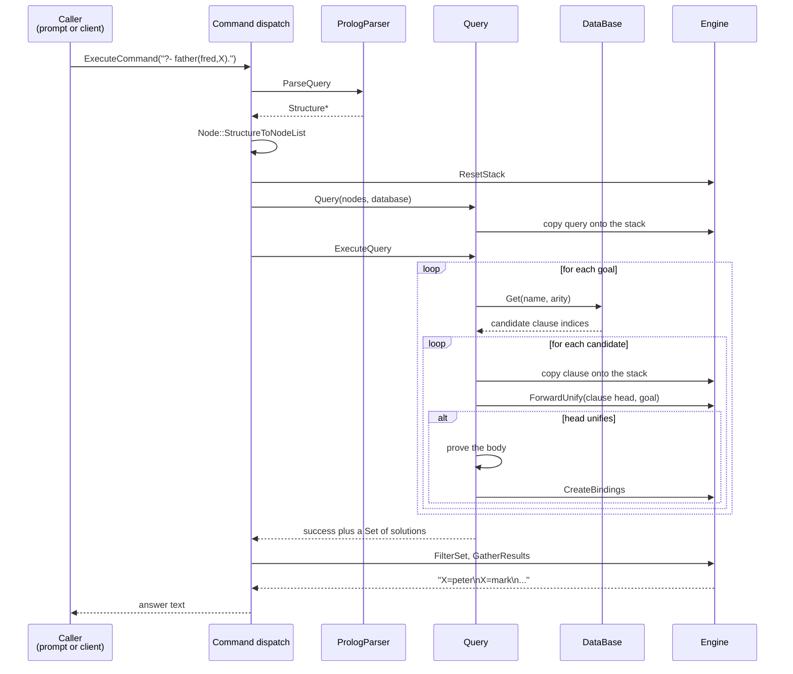

# PI Prolog Interpreter — C4 model

An architecture description in the [C4 model](https://c4model.com): context,
containers, components, and then the code-level structures that matter.

Diagrams are Mermaid and render on GitHub.

---

## Level 1 — System context

Who uses the interpreter and what it touches.

**Notes**

- The two ways in are equivalent: the same commands, the same database, the
  same answers. The TCP interface is optional and off unless `--port` is given.
- There is no authentication. `load` reads files from the machine running the
  interpreter, so the server binds to `127.0.0.1` unless told otherwise.

---

## Level 2 — Containers

The interpreter is a **single process** with no data store of its own, so this
level is deliberately thin — the structure worth reading is at level 3.

**Notes**

- The database lives only in memory. Nothing is persisted between runs except
  the command history.
- Threads inside the process: the main thread runs the prompt, one thread
  accepts connections, and one thread serves each connected client.

---

## Level 3 — Components

Inside the `prolog` process. Each box is a source file pair in `src/`.

### Responsibilities

| Component | Files | Responsibility |
| --- | --- | --- |
| Startup / CLI | `src/main.cpp` | Argument parsing, owns the `DataBase`, runs the prompt loop, starts and stops the server |
| LineEditor | `src/lineedit.cpp/h` | termios raw mode, cursor and word editing, history in `~/.pi_history`. Steps aside when input is not a terminal |
| PrologServer | `src/server.cpp/h` | Listening socket, accept loop, a thread per client, captures each answer for its own client |
| Command dispatch | `src/interpreter.cpp/h` | `ExecuteCommand` — the one place a line becomes an answer. Owns the shared `PrologParser` and publishes `EngineLock` |
| PrologParser | `src/parser.cpp/h` | Recursive-descent parser for statements, queries and interpreter commands |
| Structure | `src/structure.cpp/h` | Parse-tree node; also the global string table and per-statement variable table |
| Node | `src/node.cpp/h` | Flattens a `Structure` tree into `vector<Node*>`; printing nodes back to text |
| DataBase | `src/database.cpp/h` | Owns the clauses as node lists; `name * 1000 + arity` index onto candidate clauses |
| Query | `src/query.cpp/h` | Drives resolution: picks candidate clauses, walks `,` `;` `not` `!`, proves rule bodies |
| Engine | `src/engine.cpp/h` | The node stack, forward unification, binding creation, result-set filtering and formatting |
| Binding | `src/binding.cpp/h` | `Binding` (a pair of stack indices), `BindingList`, `Set` |
| System | `src/system.cpp/h` | Output through a per-thread `IOWriter`, formatting helpers, text file loading |
| TTime | `src/timer.cpp/h` | `CLOCK_MONOTONIC` timing for the "execution time" line |

### Concurrency

The engine keeps its state in globals, so **commands execute one at a time**.
Threads buy clients that never block each other on I/O; they do not buy
parallel solving.

Two pieces of state are deliberately *not* behind the lock, because they are
per thread instead:

- `System::writer` — `thread_local`. The main thread writes to the console; a
  client thread writes into a string it then sends back. Without this, a
  client capturing its output would steal the prompt's.
- The scratch buffers in `System::printf` / `System::lprintf` — `thread_local`
  for the same reason.

`PrologServer::running` is `std::atomic<bool>`; the accept loop is woken by a
self-pipe rather than by closing the listening socket, so no descriptor can be
reused while another thread is still selecting on it.

---

## Level 4 — Code

### The pipeline

Text becomes a tree, the tree becomes a flat list, the list is copied onto a
stack and solved there.

### Key structures

**`Structure`** — the parse tree. A tagged node: `tag` says which of the union
of fields is live (`left`/`right` for operators, `structures` for a compound
term, `list` for a list, `i`/`f`/`b`/`name` for literals).

Strings and variable names are never stored as text inside the engine.
`Structure::AddString` interns them into two tables and returns an index:

- **atoms** → an index into `stringArray` (slots 0 and 1 are pre-seeded with
  `write` and `nl`, which is how those built-ins are recognised)
- **variables** → an index into `varArray`, offset by
  `VAR_PREFIX = 0x80000000`

so the top bit of a name says "this is a variable". Variable identity is
per statement: `MarkVariableFrame` moves a watermark so that `X` in one clause
is a different variable from `X` in the next.

> These names are `size_t`. Holding one in an `int` makes it negative and it
> then never compares equal to itself — a bug that once made `ForwardBind` a
> silent no-op.

**`Node`** — the flat form. The whole clause is one contiguous array, and each
node records the size of its own subtree:

| Field | Meaning |
| --- | --- |
| `type` | the `Structure::Predicate` tag this came from |
| `name`, `arity` | interned name and argument count |
| `size` | **number of nodes in this subtree, including itself** |
| `fu` | forward link: the stack index this variable stands for, or `-1` |
| `i`, `f`, `b` | literal values |

`size` is the load-bearing invariant. Walking a term's arguments is
`index += SizeOfClause(index)` rather than pointer chasing, so a wrong `size`
silently makes the engine read the same slot forever.

**`Binding`** — a pair of stack indices, `lhs` (a variable node) and `rhs`
(what it stands for). `BindingList` is one solution; `Set` is all solutions.

### Variable binding

There is no substitution and no trail. A variable is bound by pointing `fu` at
another stack slot, and resolving one means following that chain to its end:

`Engine::GetForwardValue` walks that chain. This is why an assignment resolves
its target *before* writing to it — writing to the near end would cut the
caller off from the answer.

Three things build these links:

| Function | Links |
| --- | --- |
| `Engine::ForwardBind` | occurrences of the same variable *within* one clause |
| `Engine::ForwardUnify` | a clause head to the caller's arguments |
| `Engine::CreateBindings` | results back out of a proved clause |

### Solving a query

**A goal is solved to its complete set of solutions in one pass**, rather than
by backtracking through choice points. That single decision explains most of
what looks unusual in the engine:

- the cut truncates a solution list instead of unwinding a choice point
- a query with very many solutions holds them all in memory at once
- `FilterSet` exists at all — solutions must be reduced to the variables the
  caller actually asked about, at each clause boundary

### Memory

| Owner | Owns | Released by |
| --- | --- | --- |
| `DataBase` | the clause node lists | `Clear`, `Delete`, destructor |
| `Engine` | the node stack and every `Binding` | `ResetStack`, per query |
| `Query` / dispatch | parse trees and temporary node lists | at the end of the call |

`Binding` objects are handed out by `Engine::NewBinding` and pooled, so they
are all released together with the stack. Nothing accumulates across queries.

### Limits

| Constant | Value | Where |
| --- | --- | --- |
| `Query::MAX_PC` | 1 500 000 | stack index before "infinite recursion detected" |
| `LineEditor::MAX_HISTORY` | 500 | commands kept in `~/.pi_history` |
| `PrologServer::MAX_LINE` | 1 MiB | longest command line a client may send |
| `PrologServer::LISTEN_BACKLOG` | 16 | connections waiting to be accepted |
| `DataBase::NAME_MULTIPLIER` | 1000 | index key is `name * 1000 + arity` |
| `BUFFER_SIZE` | 10 000 | per-thread `System::printf` scratch buffer |

> `NAME_MULTIPLIER` caps arity at 999 before index keys would collide.

---

## Reading order

1. [`interpreter.cpp`](../src/interpreter.cpp) — one line in, one answer out
2. [`parser.cpp`](../src/parser.cpp) — text to `Structure`
3. [`node.cpp`](../src/node.cpp) — `Structure` to the flat node list
4. [`query.cpp`](../src/query.cpp) — the resolution loop
5. [`engine.cpp`](../src/engine.cpp) — unification and bindings underneath it
