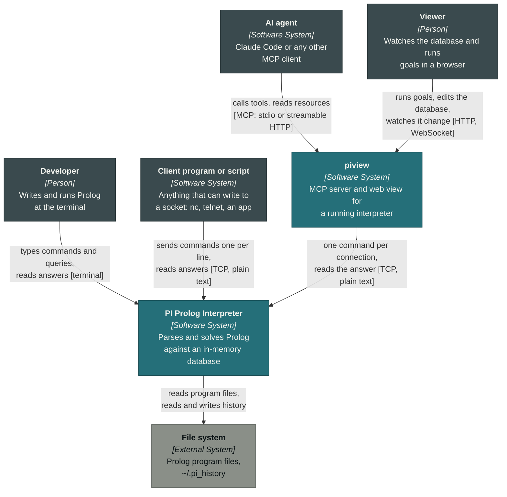
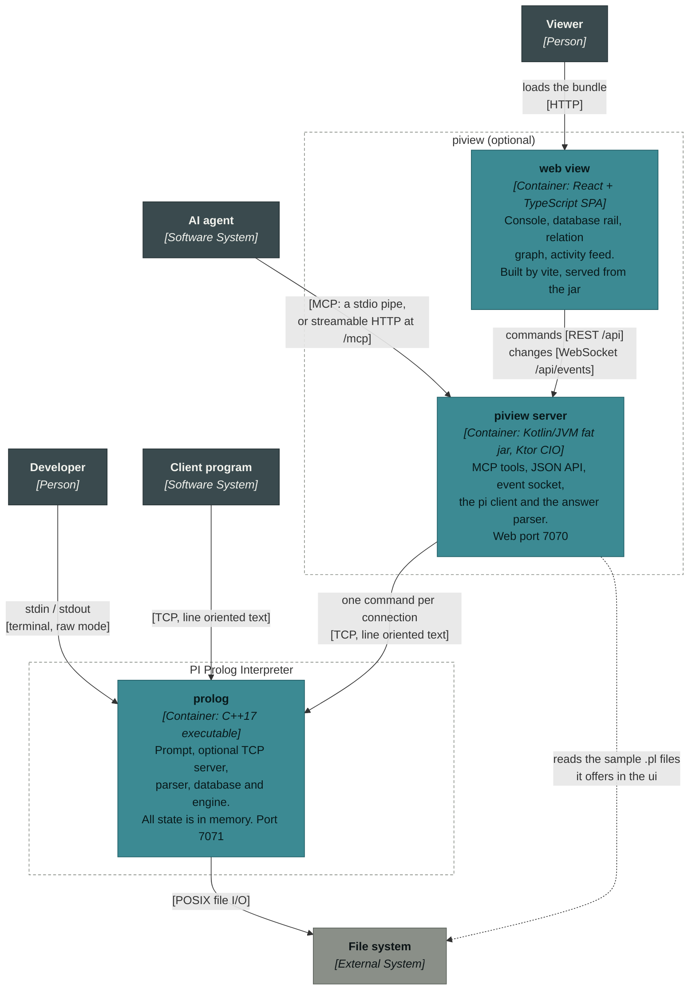
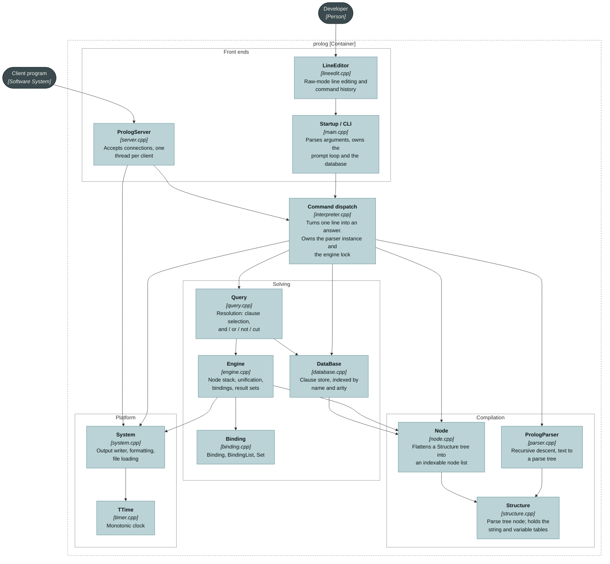
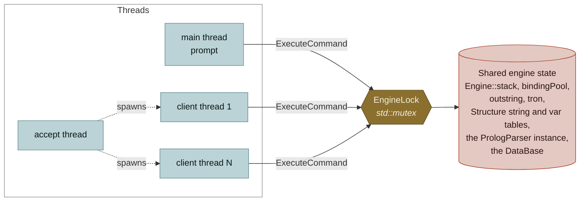
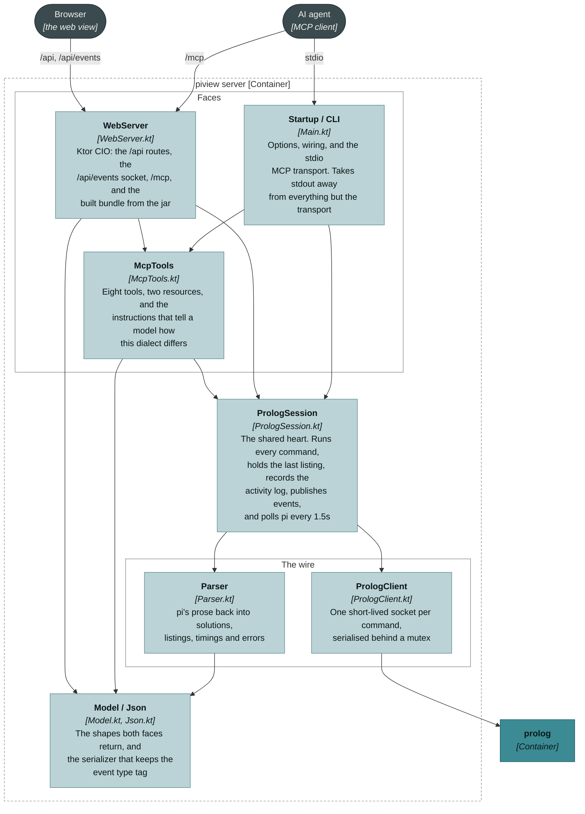
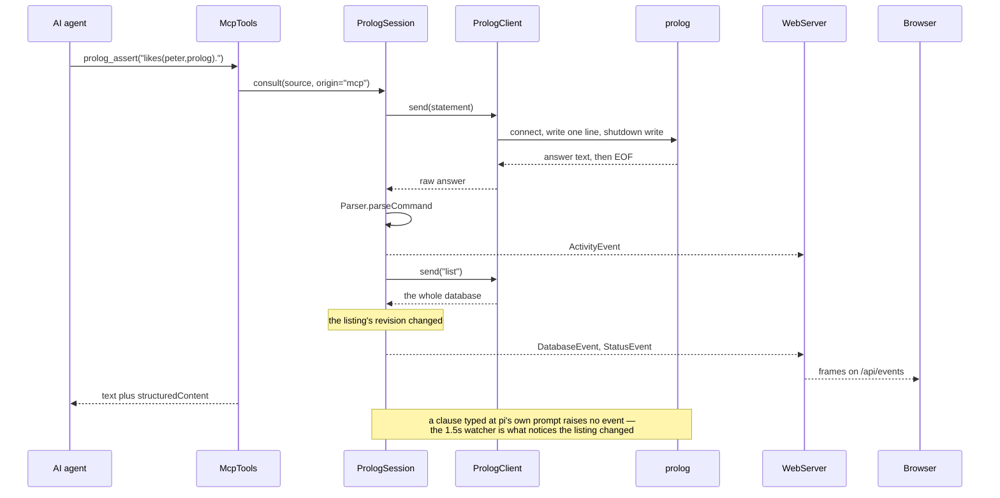
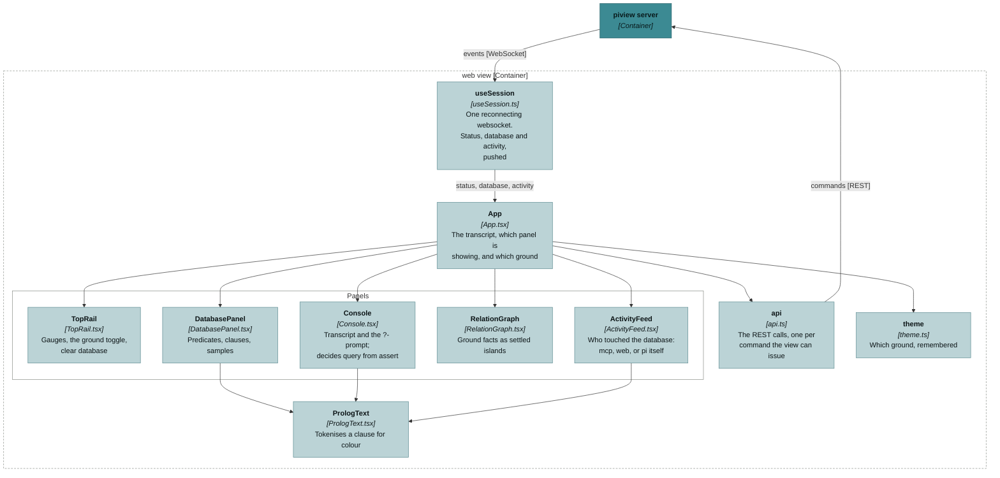
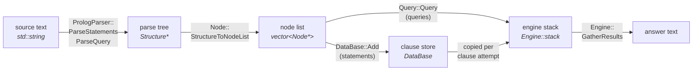
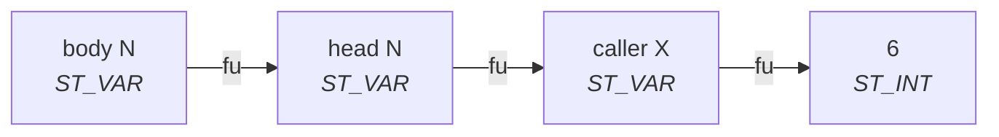
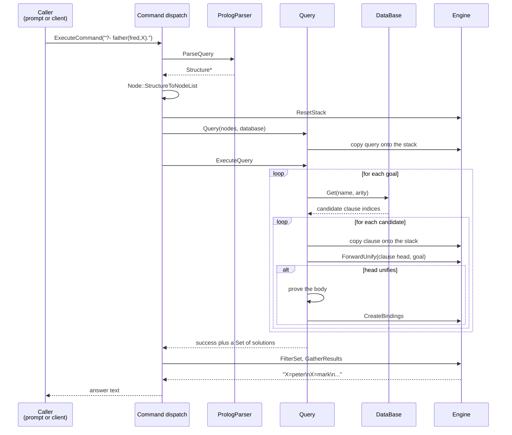

# PI Prolog Interpreter — C4 model

An architecture description in the [C4 model](https://c4model.com): context,
containers, components, and then the code-level structures that matter.

Two systems are described. **pi** (`src/`, C++17) is the interpreter: a prompt,
an optional TCP port, and an in-memory database. **piview** (`piview/`, Kotlin
and React) attaches to a running interpreter over that port and gives it two
more faces — an MCP server for agents and a web view for people. piview is
optional and pi does not know it is there; to the interpreter it is one more
client on the socket.

Diagrams are Mermaid and render on GitHub.

---

## Level 1 — System context

Who uses the interpreter and what it touches.

**Notes**

- All four ways in are equivalent: the same commands, the same database, the
  same answers. The TCP interface is optional and off unless `--port` is given;
  piview needs it, so a piview stack always starts pi with a port.
- **One database, shared by everyone on it.** A clause typed at pi's prompt, one
  asserted by an agent through MCP, and the listing in the browser are the same
  clauses. That is what piview is for — it is not a copy of pi's state, it is a
  window onto it.
- There is no authentication anywhere. `load` reads files from the machine
  running the interpreter, and piview will run any command pi accepts, so both
  ports bind to `127.0.0.1` unless told otherwise. Anything more exposed than
  that belongs behind an authenticating proxy.

---

## Level 2 — Containers

The interpreter itself is a **single process** with no data store of its own.
piview adds two more deployable pieces beside it — a JVM process and a bundle of
static files — and still no data store: the database stays in pi.

**Notes**

- The database lives only in memory, in `prolog`. Nothing is persisted between
  runs except the command history.
- Threads inside `prolog`: the main thread runs the prompt, one thread accepts
  connections, and one thread serves each connected client.
- **piview stores nothing of its own** beyond a cache: the last listing it read,
  an activity log of the last 500 commands, and whoever is currently on the
  event socket. Restarting it loses none of the program.
- **A connection per command.** pi's answers have no terminator, so on a
  connection held open there is no way to tell where one answer ends and the
  next begins. Half-closing is the only frame the protocol offers: connect,
  write one line, shut down the write side, read to EOF. It costs a socket per
  command against a loopback server, and it is what pi's own test suite does.
- **Nothing pushes out of pi**, so piview polls `list` every 1.5 s and compares
  the listing's revision. That poll is the only way a clause typed at pi's own
  prompt, or by another socket client, reaches the browser.
- Two ways in for an agent, one tool set behind them: `--stdio` speaks MCP on a
  pipe for a client that launches the process, and the same tools are mounted at
  `/mcp` on the web port for one that would rather connect over HTTP.
- Deployment is `docker compose up --build`: one image builds pi from source,
  the other builds the UI with node, drops the bundle into the jar's resources
  and runs it on a JRE. Both ports are published to loopback only.

---

## Level 3 — Components: `prolog`

Inside the `prolog` process. Each box is a source file pair in `src/`.

### Responsibilities

| Component | Files | Responsibility |
| --- | --- | --- |
| Startup / CLI | `src/main.cpp` | Argument parsing, owns the `DataBase`, runs the prompt loop, starts and stops the server |
| LineEditor | `src/lineedit.cpp/h` | termios raw mode, cursor and word editing, history in `~/.pi_history`. Steps aside when input is not a terminal |
| PrologServer | `src/server.cpp/h` | Listening socket, accept loop, a thread per client, captures each answer for its own client |
| Command dispatch | `src/interpreter.cpp/h` | `ExecuteCommand` — the one place a line becomes an answer. Owns the shared `PrologParser` and publishes `EngineLock` |
| PrologParser | `src/parser.cpp/h` | Recursive-descent parser for statements, queries and interpreter commands |
| Structure | `src/structure.cpp/h` | Parse-tree node; also the global string table and per-statement variable table |
| Node | `src/node.cpp/h` | Flattens a `Structure` tree into `vector<Node*>`; printing nodes back to text |
| DataBase | `src/database.cpp/h` | Owns the clauses as node lists; `name * 1000 + arity` index onto candidate clauses |
| Query | `src/query.cpp/h` | Drives resolution: picks candidate clauses, walks `,` `;` `not` `!`, proves rule bodies |
| Engine | `src/engine.cpp/h` | The node stack, forward unification, binding creation, result-set filtering and formatting |
| Binding | `src/binding.cpp/h` | `Binding` (a pair of stack indices), `BindingList`, `Set` |
| System | `src/system.cpp/h` | Output through a per-thread `IOWriter`, formatting helpers, text file loading |
| TTime | `src/timer.cpp/h` | `CLOCK_MONOTONIC` timing for the "execution time" line |

### Concurrency

The engine keeps its state in globals, so **commands execute one at a time**.
Threads buy clients that never block each other on I/O; they do not buy
parallel solving.

Two pieces of state are deliberately *not* behind the lock, because they are
per thread instead:

- `System::writer` — `thread_local`. The main thread writes to the console; a
  client thread writes into a string it then sends back. Without this, a
  client capturing its output would steal the prompt's.
- The scratch buffers in `System::printf` / `System::lprintf` — `thread_local`
  for the same reason.

`PrologServer::running` is `std::atomic<bool>`; the accept loop is woken by a
self-pipe rather than by closing the listening socket, so no descriptor can be
reused while another thread is still selecting on it.

---

## Level 3 — Components: `piview` server

Inside the JVM process. Each box is one Kotlin file in
`piview/server/src/main/kotlin/nz/pi/piview/`.

### Responsibilities

| Component | File | Responsibility |
| --- | --- | --- |
| Startup / CLI | `Main.kt` | Options, builds the client, session and web server, runs the stdio MCP transport. In stdio mode it moves the real stdout aside so a library banner cannot corrupt the JSON-RPC stream |
| McpTools | `McpTools.kt` | `prolog_query` `prolog_assert` `prolog_list` `prolog_delete` `prolog_load` `prolog_clear` `prolog_status` `prolog_command`, plus the `prolog://database` and `prolog://activity` resources. Every tool answers twice: text laid out as pi lays it out, and `structuredContent` with the same answer as fields |
| WebServer | `WebServer.kt` | Ktor CIO. `/api/*` for commands, `/api/events` for pushes, `/mcp` for streamable HTTP, and the React bundle from the jar's resources — or from `--ui-dir` while developing |
| PrologSession | `PrologSession.kt` | The one place a command runs, whoever asked. Owns the last `DatabaseSnapshot`, the connection status, the 500-entry activity log and the `SharedFlow` of events; starts the watcher |
| PrologClient | `PrologClient.kt` | The socket. One connection per command, a mutex so the activity feed keeps real order, and `PrologUnreachable` when pi is not there |
| Parser | `Parser.kt` | Recovers structure from pi's terminal output: solutions and their variables, the numbered listing, `(execution time …)`, and the error prefixes |
| Model / Json | `Model.kt`, `Json.kt` | `QueryResult`, `CommandResult`, `DatabaseSnapshot`, `ActivityEntry`, `ServerEvent`. piview's own `Json` keeps `classDiscriminator = "type"`, which the MCP SDK's serializer turns off — that tag is what the browser switches on |

### One database, two hands

The point of the whole thing: an agent asserting a clause and a browser watching
it land, on the same database, with no coordination between them.

Everything the browser shows about the database arrives this way. The REST calls
return the answer to the one command that was asked; the listing and the feed
are only ever pushed, so a clause typed at pi's prompt updates the view exactly
as one typed in the console does.

### Components: the web view

`piview/ui/src/`. React 19 and TypeScript, built by vite. There is no state
manager and no data-fetching library: one socket in, one module of REST calls
out.

- An agent's queries are appended to the console transcript as well, from the
  activity feed — the console is a view of the interpreter, not a log of this
  browser tab.
- The websocket backs off to a maximum of 8 s between retries and catches a new
  viewer up on connect with status, database and the whole activity log, so
  restarting the server reads as a reconnect rather than a reload.
- The design record for this surface — grounds, signals, type, the shape of an
  answer — is [`DESIGN.md`](../DESIGN.md).

---

## Level 4 — Code

The structures inside `prolog`, and then the one piece of piview that needs the
same treatment.

### The pipeline

Text becomes a tree, the tree becomes a flat list, the list is copied onto a
stack and solved there.

### Key structures

**`Structure`** — the parse tree. A tagged node: `tag` says which of the union
of fields is live (`left`/`right` for operators, `structures` for a compound
term, `list` for a list, `i`/`f`/`b`/`name` for literals).

Strings and variable names are never stored as text inside the engine.
`Structure::AddString` interns them into two tables and returns an index:

- **atoms** → an index into `stringArray` (slots 0 and 1 are pre-seeded with
  `write` and `nl`, which is how those built-ins are recognised)
- **variables** → an index into `varArray`, offset by
  `VAR_PREFIX = 0x80000000`

so the top bit of a name says "this is a variable". Variable identity is
per statement: `MarkVariableFrame` moves a watermark so that `X` in one clause
is a different variable from `X` in the next.

> These names are `size_t`. Holding one in an `int` makes it negative and it
> then never compares equal to itself — a bug that once made `ForwardBind` a
> silent no-op.

**`Node`** — the flat form. The whole clause is one contiguous array, and each
node records the size of its own subtree:

| Field | Meaning |
| --- | --- |
| `type` | the `Structure::Predicate` tag this came from |
| `name`, `arity` | interned name and argument count |
| `size` | **number of nodes in this subtree, including itself** |
| `fu` | forward link: the stack index this variable stands for, or `-1` |
| `i`, `f`, `b` | literal values |

`size` is the load-bearing invariant. Walking a term's arguments is
`index += SizeOfClause(index)` rather than pointer chasing, so a wrong `size`
silently makes the engine read the same slot forever.

**`Binding`** — a pair of stack indices, `lhs` (a variable node) and `rhs`
(what it stands for). `BindingList` is one solution; `Set` is all solutions.

### Variable binding

There is no substitution and no trail. A variable is bound by pointing `fu` at
another stack slot, and resolving one means following that chain to its end:

`Engine::GetForwardValue` walks that chain. This is why an assignment resolves
its target *before* writing to it — writing to the near end would cut the
caller off from the answer.

Three things build these links:

| Function | Links |
| --- | --- |
| `Engine::ForwardBind` | occurrences of the same variable *within* one clause |
| `Engine::ForwardUnify` | a clause head to the caller's arguments |
| `Engine::CreateBindings` | results back out of a proved clause |

### Solving a query

**A goal is solved to its complete set of solutions in one pass**, rather than
by backtracking through choice points. That single decision explains most of
what looks unusual in the engine:

- the cut truncates a solution list instead of unwinding a choice point
- a query with very many solutions holds them all in memory at once
- `FilterSet` exists at all — solutions must be reduced to the variables the
  caller actually asked about, at each clause boundary

### Memory

| Owner | Owns | Released by |
| --- | --- | --- |
| `DataBase` | the clause node lists | `Clear`, `Delete`, destructor |
| `Engine` | the node stack and every `Binding` | `ResetStack`, per query |
| `Query` / dispatch | parse trees and temporary node lists | at the end of the call |

`Binding` objects are handed out by `Engine::NewBinding` and pooled, so they
are all released together with the stack. Nothing accumulates across queries.

### Limits

| Constant | Value | Where |
| --- | --- | --- |
| `Query::MAX_PC` | 1 500 000 | stack index before "infinite recursion detected" |
| `LineEditor::MAX_HISTORY` | 500 | commands kept in `~/.pi_history` |
| `PrologServer::MAX_LINE` | 1 MiB | longest command line a client may send |
| `PrologServer::LISTEN_BACKLOG` | 16 | connections waiting to be accepted |
| `DataBase::NAME_MULTIPLIER` | 1000 | index key is `name * 1000 + arity` |
| `BUFFER_SIZE` | 10 000 | per-thread `System::printf` scratch buffer |

> `NAME_MULTIPLIER` caps arity at 999 before index keys would collide.

### piview: reading pi's prose

pi has no machine-readable mode. It answers in the same text it prints at the
prompt, so `Parser.kt` recovers the shape of an answer rather than reading it off
a field. Two facts about the interpreter make that reliable, and both are
properties of the C++ above:

- a query's output is built in one order — anything `write/1` printed, then one
  `Var=value` line per binding per solution, then a bare `yes` if there were no
  bindings at all (`Query::ExecuteQuery`);
- solutions are emitted back to back with **no separator**, but a solution binds
  each variable at most once (`Engine::GatherResults`) — so **a repeated variable
  name is where the next solution starts**.

That second rule is the whole grouping algorithm. Everything else is a literal
the interpreter prints verbatim:

| In the answer | Recovered as |
| --- | --- |
| `^([A-Z_][A-Za-z0-9_]*)=(.*)$` | one binding; a name already in the current solution opens the next |
| `(execution time N seconds)` | `executionSeconds`, always the last line when the goal ran |
| `no` | `Outcome.FAILURE` |
| `error parsing query:`, `could not load database file`, … | `Outcome.ERROR` — the goal never ran |
| lines before the first binding | `write/1` output, which is not an answer |
| `^(\d+)\s{2,}(.*)$` | a numbered clause in a `list`ing |

Two consequences worth knowing:

- Text that is none of those — no bindings, no `yes`, no known error prefix — is
  passed through as program output rather than parsed into bindings that were
  never there. An invented answer would be worse than an unstructured one.
- A listing's **revision is the hash of its numbered text**. That is what the
  1.5 s watcher compares, and a database event is only pushed when it differs,
  so idle polling costs one `list` command and no traffic to the browser.

Every answer keeps its `raw` text alongside the parse, and the web view offers
it under each entry: the parse is a convenience, and the wire is the truth.

---

## Reading order

**The interpreter**

1. [`interpreter.cpp`](../src/interpreter.cpp) — one line in, one answer out
2. [`parser.cpp`](../src/parser.cpp) — text to `Structure`
3. [`node.cpp`](../src/node.cpp) — `Structure` to the flat node list
4. [`query.cpp`](../src/query.cpp) — the resolution loop
5. [`engine.cpp`](../src/engine.cpp) — unification and bindings underneath it

**piview**

1. [`PrologSession.kt`](../piview/server/src/main/kotlin/nz/pi/piview/PrologSession.kt)
   — every command, whoever asked, and the events that follow
2. [`PrologClient.kt`](../piview/server/src/main/kotlin/nz/pi/piview/PrologClient.kt)
   — the socket, and why there is one per command
3. [`Parser.kt`](../piview/server/src/main/kotlin/nz/pi/piview/Parser.kt)
   — pi's prose back into structure
4. [`McpTools.kt`](../piview/server/src/main/kotlin/nz/pi/piview/McpTools.kt)
   — the agent's face
5. [`WebServer.kt`](../piview/server/src/main/kotlin/nz/pi/piview/WebServer.kt)
   — the browser's, plus `/mcp`
6. [`useSession.ts`](../piview/ui/src/useSession.ts) — the socket the web view
   reads everything from
